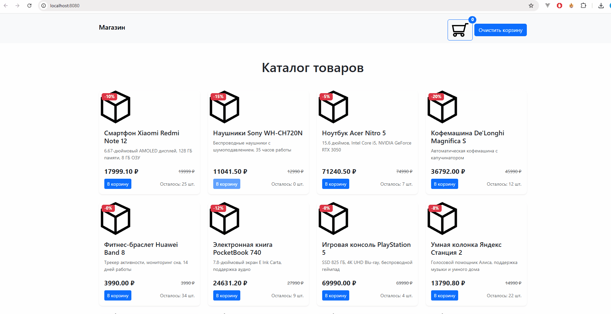

## Правила и регламент

- [Экзамен: правила, рекомендации и порядок проведения](https://hexly.notion.site/d9289c18871c44508bc7c7f05a51d94f)

## Задание



Ваша задача написать программные модули для интернет магазина. На главной странице необходимо отрендерить список товаров, которые приходят с бэкенда и реализовать возможность добавления товаров в корзину. На странице корзины также необходимо отобразить все добавленные в корзину товары.

## Запуск и сборка приложения

Для запуска приложения используйте команду:

```bash
make run # запускается сервер и сборка
```

Перед запуском тестов убедитесь, что у вас работает сервер.

## Задача 1

В **src/types.ts** обозначьте и экспортируйте тип или интерфейс *Product*, который реализует структуру продукта, которую можно посмотреть в ****fixtures**/response.js**.

В **src/productCard.js** реализуйте и экспортируйте по умолчанию функцию, которая принимает на вход объект типа товар и возвращает для него следующий html в виде строки:

```html
<div class="col">
    <div class="card h-100 shadow-sm">
    <span class="badge bg-danger position-absolute mt-2 ms-2">-15%</span> // скидка товара
    
    <div class="card-body d-flex flex-column">
        <h5 class="card-title">Наушники Sony WH-CH720N</h5> // имя товара
        <p class="card-text text-muted small">Беспроводные наушники с шумоподавлением, 35 часов работы</p> // описание товара
        <div class="mt-auto">
            <div class="d-flex justify-content-between align-items-center mb-2">
                <span class="fs-5 fw-bold">11041.50 ₽</span> // цена с учетом скидки
                <span class="text-decoration-line-through text-muted small">12990 ₽</span> // изначальная цена
            </div>
        <div class="d-flex justify-content-between align-items-center">
                <button disabled="" data-id="2" class="addToCart btn btn-primary btn-sm">В корзину</button>
                <span class="text-muted small">Осталось: 0 шт.</span> // Количество на складе
        </div>
        </div>
    </div>
    </div>
</div>
```

Реализация через строку и innerHTML в данном случае необходимое упрощение, поскольку вручную долго писать все эти теги и стили.

## Задача 2

В **app.ts** реализуйте вывод товаров на главной странице. Карточки товаров выводятся как innerHTML элемента с классом **product-container**.

Для получения товаров нужно обратиться на сервер с помощью GET запроса по адресу `/products`. Если товара на складе нет, то кнопка `В корзину` должна иметь атрибут `disabled`.

## Задача 3
тест
Реализуйте возможность добавления товаров в корзину с помощью POST запроса на маршрут `/cart`, при клике на кнопку `В корзину`. Сервер принимает вместе с запросом id товара, например:

```typescript
axios.post('/cart', { id: 1 });
```

Сервер обрабатывает запрос и помещает этот товар в таблицу товаров в корзине пользователя. Чтобы отправить id товара добавьте на кнопку карточки товара атрибут `data-id`, который вы сможете прочитать при отправке запроса.

Реализуйте изменение индикатора количества товаров в корзине при добавлении товара в элементе с id **cartCounter**.

```html
<span id="cartCounter"
class="position-absolute top-0 start-100 translate-middle badge rounded-pill bg-primary">
    1
</span>
```

Реализуйте возможность сброса счетчика корзины с помощью POST запроса на маршрут `/reset`, при клике на кнопку `Очистить корзину`.

Для управления состоянием корзины и ее отрисовки вы можете использовать файл **setCart.ts**.

## Задача 4

Реализуйте функционал модального окна корзины пользователя. При клике на элемент с id **cartButton** должна открываться модалка (которая уже есть в html), а при клике на кнопку c id **cartButtonClose** модалка должна закрываться.

В **types.ts** обозначьте тип или интерфейс **CartItem**, который, помимо всех свойств товара, имеет также свойство `count`, равное количеству добавленных в корзину товаров. Общее число товаров в корзине в элементе `#cartCounter` нужно выводить с учетом этих данных, то есть сосчитав суммарное количество всех товаров.

Реализуйте вывод товаров в корзине, которые должна выводиться как дочерние у элемента \<tbody id="CartItemsList"/>.

```html
<tbody id="cartItemsList">
    <tr>
        <td>Смартфон Xiaomi Redmi Note 12</td> // имя
        <td>17999.10</td> // цена с учетом скидки
        <td>3</td> // количество в корзине
    </tr>
    <tr>
        <td>Ноутбук Acer Nitro 5</td>
        <td>71240.50</td>
        <td>6</td>
    </tr>
</tbody>
```
